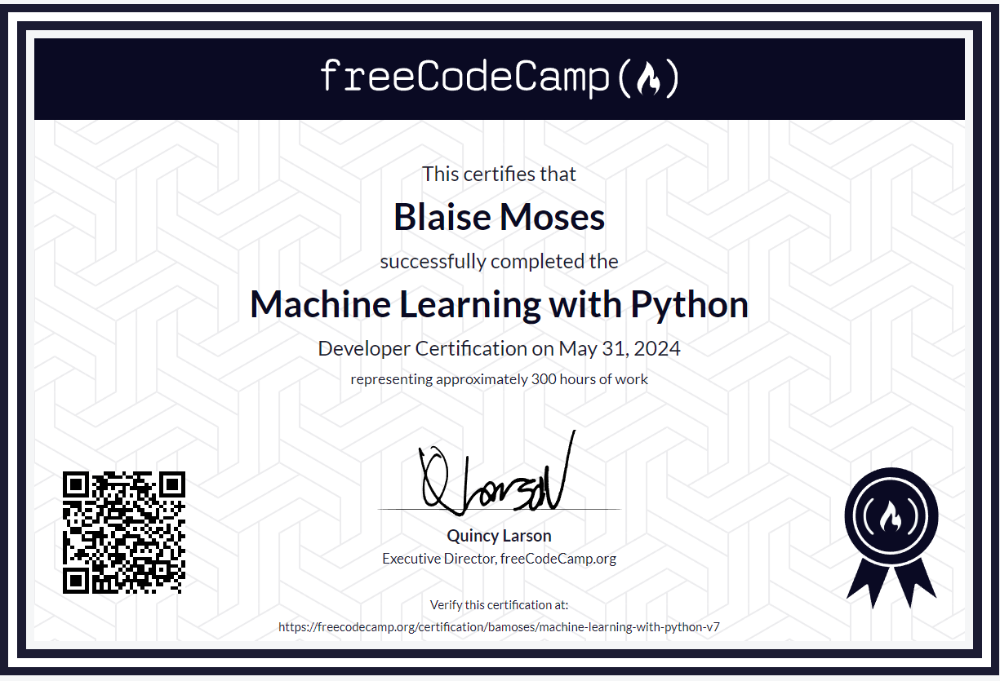

# Machine Learning Projects - FreeCodeCamp.org Certification

This repository contains machine learning projects completed as part of the Machine Learning in Python Certification from FreeCodeCamp.org. Each project showcases different machine learning techniques and models applied to various real-world problems.

## Certificate

## Projects Overview

### 1. HealthCare Costs Estimator
- **Description:** A model to estimate healthcare costs based on various lifestyle factors.
- **Algorithm:** Linear Regression
- **Libraries:** TensorFlow Keras, Pandas, Numpy
- **Key Features:**
  - Engineered a linear regression model to accurately predict healthcare costs.
  - Preprocessed data to handle missing values and categorical variables using Pandas and Numpy.
  - Evaluated model performance using mean absolute error (MAE), ensuring a MAE less than $3500
  - was always generated. My model averages an MSE of $2800.
### 2. Book Recommendation Algorithm
- **Description:** A recommendation system to suggest similar books to a user based on similarity in review
  patterns among users.
- **Algorithm:** K-Nearest Neighbors (KNN)
- **Libraries:** Scikit-learn, Pandas, Numpy
- **Key Features:**
  - Implemented a KNN algorithm to find similar user review patterns and recommend books.
  - Utilized cosine similarity to measure the distance between user preferences.
  - Optimized the model by tuning the number of neighbors (k) to give a user 5 books to choose from in order
    of their match score.
### 3. SMS Spam Classification
- **Description:** A model to classify SMS messages as spam or not spam.
- **Algorithm:** Recurrent Neural Network (RNN)
- **Libraries:** Keras, Pandas, Numpy
- **Key Features:**
  - Built an RNN model to process and classify text data to a 98% accuracy rate.
  - Employed LSTM layers to capture long-term dependencies in the text.
  - Preprocessed SMS messages with tokenization and padding to handle varying lengths.

### 4. Cat/Dog Image Classification
- **Description:** A model to classify images of cats and dogs.
- **Algorithm:** Convolutional Neural Network (CNN)
- **Libraries:** Keras, Pandas, Matplotlib, Numpy
- **Key Features:**
  - Developed a CNN model to distinguish between images of cats and dogs.
  - Applied data augmentation techniques to enhance the training dataset and prevent overfitting.
  - Evaluated the model with accuracy of prediction, achieving a 70% accuracy rate in classification.

### 5. Markov Chain Based Rock Paper Scissors Agent
- **Description:** An agent to play the game of Rock Paper Scissors using Markov Chains.
- **Algorithm:** Markov Chain
- **Libraries:** None, custom implementation
- **Key Features:**
  - Created a Markov Chain model to predict the opponent's next move and defeat 4 opponent algorithms.
  - Analyzed historical game data to estimate transition probabilities and counter opponent strategies.
  - The code for this project isn't in repo , but you can see and run my test in the Gitpod
  environment here : https://freecodecam-boilerplate-u6w86tehc65.ws-us114.gitpod.io/
  -everything in RPS.py is my code, the rest of the enviroment was provided
## License
This repository is licensed under the MIT License. See the [LICENSE](LICENSE) file for more details.
